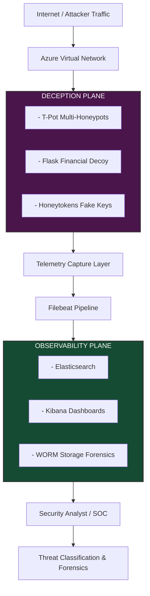

# 🛡️ Cloud-Native Deception Architecture (Financial Systems)

---

## 1. SYSTEM SUMMARY

This system implements a **cloud-native deception and threat intelligence architecture** deployed on Azure.

It exposes intentionally crafted **financial-system decoys, honeypots, and honeytokens** inside a strictly isolated network plane to capture unauthorized access attempts. Every interaction is treated as adversarial and converted into high-confidence security telemetry.

> **Domain:** Cloud Security • Deception Engineering • Threat Intelligence • SOC Engineering

---

## 🚀 SKILL MAPPING (Recruiter View)

### ☁️ Cloud Security Engineering
* Azure Virtual Network isolation design
* Multi-plane architecture (deception / observability separation)
* Secure network segmentation using NSGs

### 🔍 Detection Engineering
* Event-driven attack detection pipelines
* Log correlation across ELK stack
* High-interaction honeypot telemetry design

### 🏗️ Security Architecture
* Threat modeling of adversary behavior flows
* Zero-trust segmentation design
* Attack surface minimization strategies

### 💻 Systems Design
* Multi-layer distributed architecture design
* Event ingestion → processing → analysis pipelines
* State-based detection logic systems

---

## 2. ARCHITECTURE OVERVIEW

### 🗺️ System Flow



### 📋 Component Mapping

| Layer | Components |
| --- | --- |
| **Deception Plane** | T-Pot Honeypots, Flask Financial Decoy, Honeytokens |
| **Telemetry Layer** | Filebeat |
| **Storage Layer** | Elasticsearch |
| **Visualization Layer** | Kibana |
| **Forensics Layer** | WORM Storage |
| **Cloud Layer** | Azure Virtual Network |

---

## 3. THREAT MODEL / ASSUMPTIONS

### 🎯 Core Assumptions

* Any interaction with the deception plane is **non-legitimate by definition**.
* No production system should ever reference or route to decoy assets.
* Attackers reach the system via scanning, credential reuse, or enumeration.

### ⚠️ Failure Conditions

* Misconfigured DNS exposes decoy to real users.
* Log pipeline failure (Filebeat / Elasticsearch outage).
* VM compromise beyond honeypot boundary.
* Network segmentation failure (NSG misconfiguration).

### 🔒 Trust Boundaries

* **Deception Plane:** Sacrificial / intentionally exposed
* **Observability Plane:** Trusted analytics zone
* **Production Plane:** Fully isolated (no routing path exists)

---

## 4. CORE ENGINEERING DESIGN

### 🔄 Deception Execution Model

```
Trigger  ➔  Engage  ➔  Log  ➔  Analyze  ➔  Retain

```

### 🪤 Attack Lifecycle Capture

* **Reconnaissance:** Scanning / enumeration
* **Service Probing:** SSH, HTTP, API endpoints
* **Credential Attempts:** Bruteforce / stuffing
* **Payload Injection:** SQLi, traversal, fuzzing
* **Session Behavior Tracking:** Dwell time analysis

### 🎭 Decoy Behavior Model

* Flask-based banking UI simulates real financial workflows.
* Fake authentication systems encourage credential reuse.
* API endpoints simulate transactional behavior.
* Honeytokens detect unauthorized key usage.

---

## 5. OBSERVABILITY / TELEMETRY

### 🗂️ Captured Security Events

* `login_attempt`
* `credential_stuffing`
* `api_transfer_attempt`
* `sql_injection_payload`
* `port_scan_activity`
* `session_dwell_time`

### 📝 Example Event

```json
{
  "event": "CREDENTIAL_STUFFING",
  "username": "admin",
  "source_ip": "185.x.x.x",
  "target": "financial-decoy",
  "action": "login_attempt"
}

```

### 📊 Key Metrics

* **📊 Average attacker dwell time:** `131s`
* **🎯 False positive rate:** `0% (by design)`
* **📈 Attack diversity:** `12+ observed techniques`
* **🌐 Total unique attackers:** `847 IPs`

---

## 6. DEPLOYMENT / USAGE

### 🏗️ Infrastructure Setup

```bash
./deploy-tpot-vm.sh
./deploy-mgmt-vm.sh

```

### 🎭 Decoy Deployment

```bash
git clone <repo>
cd financial-decoy
python3 -m venv venv
source venv/bin/activate  # On Windows use `venv\Scripts\activate`
pip install -r requirements.txt

```

### 👁️ Observability Stack

```bash
sudo apt install filebeat
sudo systemctl enable filebeat

```

---

## 7. DESIGN TRADEOFFS / LIMITATIONS

### ✅ Optimizations

* High-interaction decoys increase attacker dwell time.
* ELK stack provides deep forensic visibility.
* Azure VNet segmentation ensures strict isolation.

### ⚖️ Tradeoffs

* High infrastructure cost (ELK + VMs).
* Operational complexity in multi-plane architecture.
* Manual tuning required for realism of decoy systems.

### 🛑 Limitations

* No automated attacker attribution (IP-based only).
* No ML-based anomaly scoring pipeline.
* Manual analysis required in Kibana.

### 🔮 Future Improvements

* ML-based attack classification layer.
* Kafka streaming pipeline for telemetry.
* Multi-region deception deployment.
* Automated threat scoring engine.

---

## 8. SYSTEM DESIGN PRINCIPLE

> 💡 **Principle:** *“Isolation creates truth.”*

Any interaction with the system is meaningful because:

1. Legitimate users never reach the deception layer.
2. Exposure is intentional and controlled.
3. Every interaction implies adversarial behavior.

---

## 📁 REPOSITORY STRUCTURE

```text
CLOUD-NATIVE-DECEPTION-ARCHITECTURE/
│
├── README.md
├── Code/
│   ├── infrastructure/
│   │   ├── azure-cli/
│   │   │   ├── deploy-mgmt-vm.sh
│   │   │   └── deploy-tpot-vm.sh
│   │   └── network-security/
│   │       └── nsg-rules.md
│   ├── observability/
│   │   ├── filebeat/
│   │   │   └── financial-decoy-filebeat.yml
│   │   └── kibana/
│   │       └── runtime-fields.md
│   └── src/
│       ├── financial-decoy/
│       │   ├── app.py
│       │   ├── requirements.txt
│       │   ├── systemd/
│       │   └── templates/
│       └── honeypot/
│           └── tpot-install.sh
└── Documentation/
    ├── Deception-architecture-Final Presentation .pdf
    ├── Final.pdf
    ├── Implementation guide.pdf
    ├── Initial-app-video.webm
    ├── Video-of-dashboards.webm
    ├── attack-telemetry.md
    └── threat-model.md

```

---

## 🎥 VIDEO DEMO

* **🎬 Live Decoy Demo:** [Watch on Google Drive](https://drive.google.com/file/d/1aQp8DLXMRVBkOPcA_DpVBGQVooUjIYgN/view?usp=drive_link)
* **📈 Live Dashboard Demo:** [Watch on Google Drive](https://drive.google.com/file/d/1PZVWDbe-UnGyFfVfUR6mxypAOTOyE5Tn/view?usp=drive_link)

```

```
